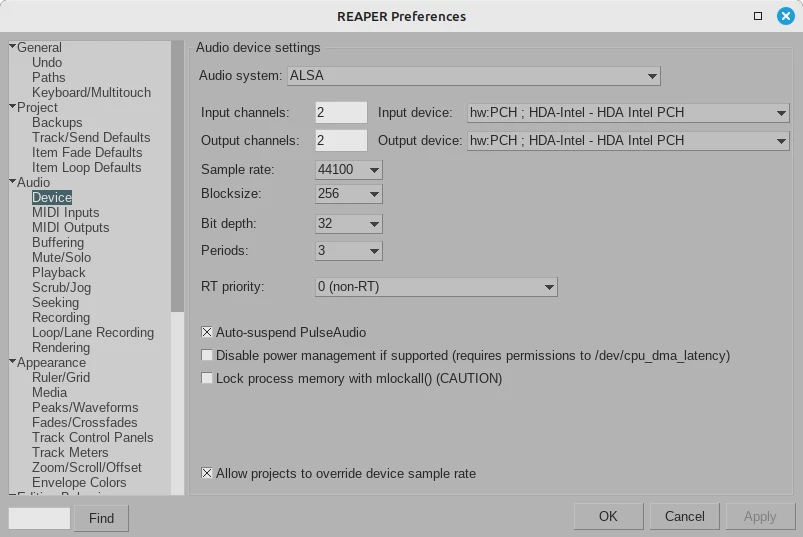
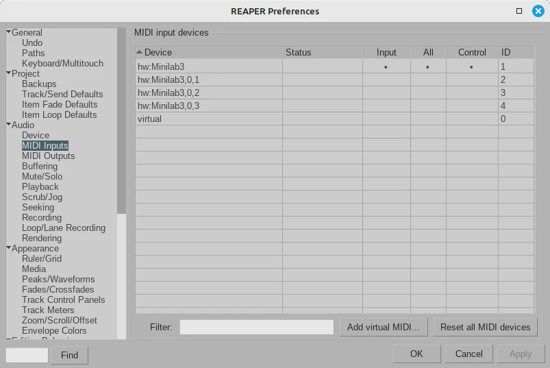

## Audio Device

1. **Options** -> **Preferences** -> **Audio** -> **Device**
2. Select your **Audio System** from the drop down menu (*ALSA* in the image below).
3. Select the **Input device** and the **Output device** from the drop down menu (*HDA Intel PCH* in the image below).
4. Click **OK** button

## MIDI

### Configuring MIDI

1. Plug your MIDI keyboard
2. **Options** -> **Preferences** -> **Audio** -> **MIDI Inputs**
3. In the grid, click on the **Input** and **Control** cells for your MIDI keyboard Device (in the picture below is a Minilab3). This way the cells **Input**, **All** and **Control** will be activated (black dot).
4. Click **OK** button.

**Input** will control the key on the MIDI keyboard. **Control** will control the knobs and sliders on the MIDI keyboard.

### Adding a MIDI track

In order to avoid bugs when adding a midi instrument, instead of creating an empty track, right click and select `insert virtual instrument on new track`

