## Audio Device

You must first setup Reaper for your audio interface:

1. Plug in your audio interface to your computer.
2. Plug in your microphone to the audio interface.
3. Plug in your headphones to the audio interface.
4. **Options** -> **Preferences** -> **Audio** -> **Device**
5. Select your **Audio System** from the drop down menu (*ALSA* in the image below).
6. Select your audio interface as **Input device** and **Output device** from the drop down menu (*MiniFuse 1* in the image below).
7. Click **OK** button.

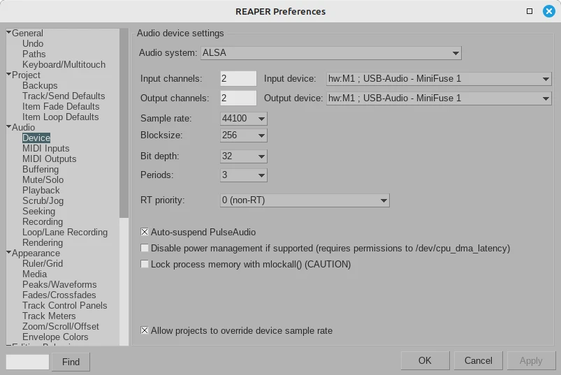

## Monitoring

During this example, I'll be using two different tools to check the levels for the track and for the whole project.

**Loudness Meter Peak** is used only to monitor the **Track** levels. *Loudness Meter Peak* can be added as an effect to a track, and must be added as the last effect in order to monitor all the effect of the track.

**Dry Run** can be used to monitor either a track levels or the whole project levels. You can launch **Dry Run** by going to **File** -> **Render** -> **Dry run (no output)**. In order to monitor the whole project or to monitor only a track, select either `Master mix` or `Selected tracks (stems)` respectively from the **Source** drop down menu. Once you have selected your source, click on the `Dry run (no output` button at the bottom.

Note that both tools will show different values once you start adding effects to a track if you've set up `Master mix` as source, so it is **very important that you are aware** wheter you are launching **Dry Run** for the whole project (`Master mix`) or for a track (`Selected tracks (stems)`).

## Actions

There is one action to perform in our track before adding any effect: ***Normalization***.

1. Right click on the track -> **Item properties...** -> **Volume/pan** -> Click on **Normalize** button.
2. Under **Normalize to:** drop down menu, select `LUFS-I`.
3. Type in `-16.00` on the **LU** text box.
4. If your track is mono, tick the box **Adjust mono media an additional -3dB**.
5. Click **OK** button.

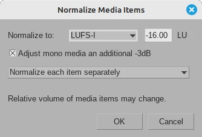

6. You can check if the **LUFS-I** value is right by running **File**->**Render**->**Dry Run**:

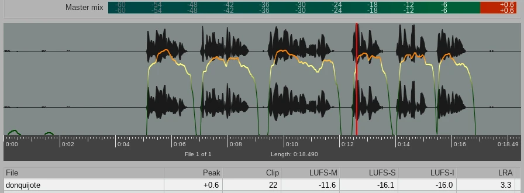

For a mono track, the **LUFS-I** value you should be between `-16.00` and `-19.00`. In the image above is `-16.00`.

Note that the **Peak** is clipping at `+0.6`. You can visualize in the image above:

1. In the *Master mix* bar on the top.
2. In the red spike on the waveform at aprox. second `12.5`.
3. In the *Peak* column at the bottom.

You want to keep the **Peak** value lower than `-1.00`. I'll fix that later with **1175 Compressor**.

**Note:** If you play the track where the spike is, you will see that the track peak meter and the Master peak meter turn yellow with a fixed red peak level indicator (rectangle on top with a number) next to the volume faders. You can reset the peak meters to normal again by clicking on the peak level indicator on both peak meters.

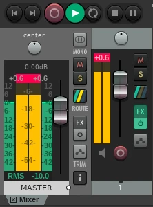

## Effects

These are the Reaper FXs for Voice Over. Add them in your track in the order presented:

1. [ReaFIR](https://wiki.cockos.com/wiki/index.php/ReaFIR): EQ and dynamics. This effect is used to silence background noise.
2. [ReaGate](https://wiki.cockos.com/wiki/index.php/ReaGate): Noise Gate. This effect complements ReaFIR and is used to remove any remaining sound below the main subject levels.
3. [ReaComp](https://wiki.cockos.com/wiki/index.php/ReaComp): Compressor. Used to reduce peak levels by decreasing dynamic range. On this project, however, I'll be using **1175 Compressor** instaed of **ReaComp**.

4. [ReaEQ](https://wiki.cockos.com/wiki/index.php/ReaEQ): Multi-band equalizer. Used to increase or decrease the gain of a particular frequency. 

**ReaFIR** and **ReaGate** are used to silence background noise. Both effects work well in conjuction. **ReaFIR** is used before **ReaGate**.

Full list of stock Reaper effects: [Click here](https://wiki.cockos.com/wiki/index.php/ReaperEffects#Effects_written_by_Cockos.2C_the_REAPER_development_team)

### 1. ReaFIR

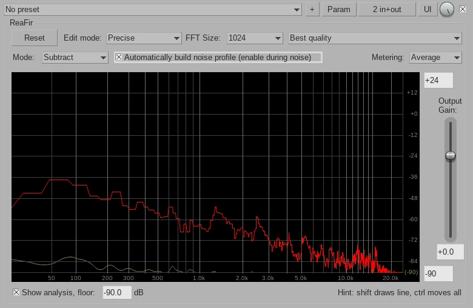

1. Change the `mode` to **Substract**, the `edit Mode` to **Precise** and the `FFT Size` to **512** or **1024**.
2. Record/play a silence section of the track and then tick the box `Automatically build noise profile`. The noise profile will be drawn until you untick the box again. After that you can adjust the profile graph up and down by holding the CTRL key while dragging the graph with the mouse.

### 2. ReaGate

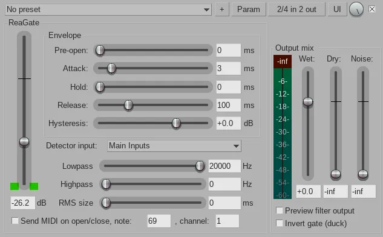

To get the correct ReaGate threshold (in the picture above is `-26.2`), you must record/play a few seconds of the lower levels of the track in order to silence those levels. After this you can tweek the threshold slider until the sound dissapears without affecting the main subject levels.

### 3. 1175 Compressor

1. Play the track and monitor the highest peak levels by using the **Loudness Meter Peak** effect (add the effect at the end of the effect chain). Alternatively, if your track is very long, you can get the high peak levels by running **File**->**Render**->**Dry Run**.
2. Adjust the **Threshold (dB)** slider until the **Peak Clips** of the **Loudness Meter Peak** effect or the **Peak** of **Dry Run** gets aprox. to `-1.00`. Always be sure that **LUFS-I** is between `-16.00` and `-19.00`.
3. You can leave the rest of settings to their default values for now.

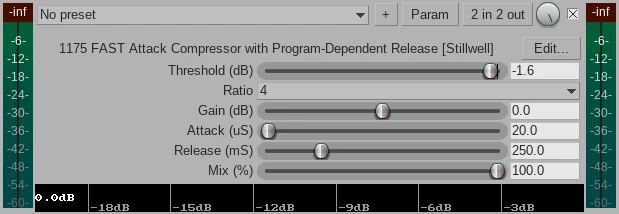

After ajusting the **Threshold (dB)** to `-1.6` as shown in the image above, this is what the **Loudness Meter Peak** and **Dry Run** shows:

**[Dry Run]**

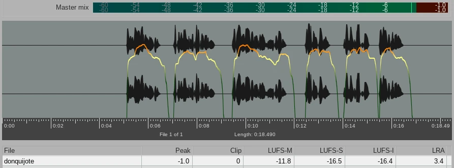

**[Loudness Meter Peak]**

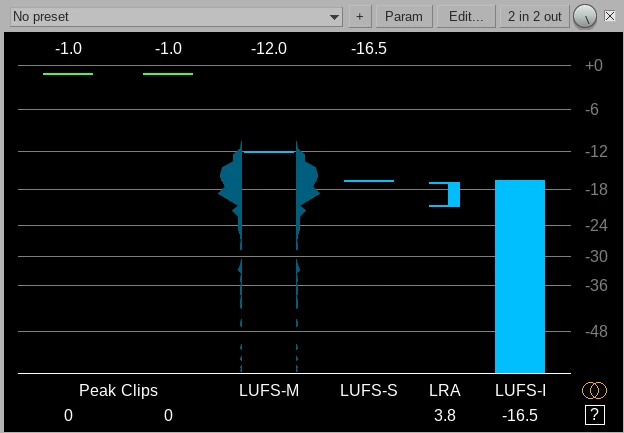

### 4. ReaEQ

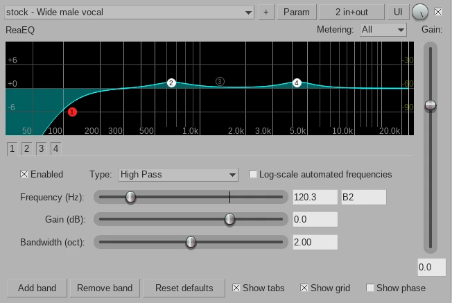

The only parameter to change here is the preset. Select **stock - Wide male vocal** from the drop down menu.

After changing the preset, move the **Loudness Meter Peak** effect to the end of the effect chain and play the track (or launch **Dry Run** for the track): the **Peak** and **LUFS-I** will change to `-1.5` and `-16.7` respectively. You can tweek the **Gain (dB)** value of the **1175 Compressor** to `+0.5` to compensate:

Now the **Peak** and **LUFS-I** go back to `-1.0` and `-16.2` respectively.

## Master Mix Levels (optional)

Optionally you can add the **ReaLimit** effect to the Master mix levels and set **Brickwall ceiling** to `-1.00` and tick the box **True peak**. This way, regardless of the individual tracks effects, the whole project will never go above -1.0 dB.

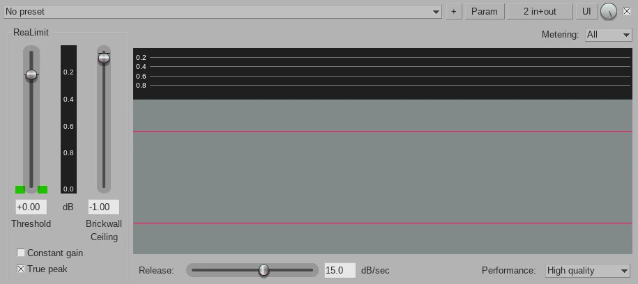

Due to the fact that any effect added to the Master Mix will be added on top of the Track effects, the Master Mix **Peak** value is now `-2.00`.

For instance, in this example the Track has a **Peak** value of `-1.00`, and I added a **ReaLimit** effect to the Master Mix with a **Brickwall ceiling** value of `-1.00`, hence the Master **Peak** value will become `-2.00`.
